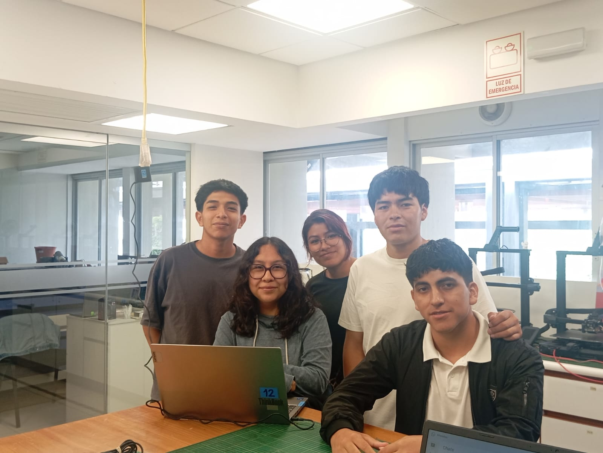

# 🌍 Equipo 13 — Fundamentos de Diseño ✦  ⁺
### Carreras de Ingeniería Ambiental / Informática / Industrial  
**Universidad Peruana Cayetano Heredia**

---

## I. Identidad & Propósito  

### 🧭 Propuesta de Valor — Diseñar para la autonomía

En el contexto urbano actual, la calidad del aire no es una condición garantizada, sino una variable invisible que afecta directamente la salud, el rendimiento cognitivo y la calidad de vida de las personas. En ciudades como Lima Metropolitana, la exposición constante a Material Particulado (PM2.5 y PM10) y a elevadas concentraciones de CO₂ en espacios cerrados configura un escenario donde respirar aire limpio deja de ser un derecho efectivo y se convierte en una condición desigual.

Diversos estudios evidencian que, incluso cuando los valores diarios no superan los estándares nacionales, los promedios anuales de contaminantes sí exceden las recomendaciones internacionales, particularmente las establecidas por la Organización Mundial de la Salud. Esta exposición prolongada incrementa el riesgo de enfermedades respiratorias, deterioro cognitivo y reducción del bienestar general.

Frente a esta realidad, nuestro enfoque no se orienta a soluciones dependientes del usuario o del contexto privilegiado, sino a sistemas capaces de operar de manera autónoma, adaptándose a entornos donde la ventilación natural resulta insuficiente o ineficiente.

Diseñamos para reducir la dependencia del comportamiento humano como factor de control ambiental, trasladando la responsabilidad hacia sistemas inteligentes que garanticen condiciones mínimas de salubridad en espacios de alta densidad.

---

### 🎯 Misión del Equipo  

Como Equipo 13, asumimos el compromiso de desarrollar soluciones de ingeniería que integren tecnología, sostenibilidad y responsabilidad social, orientadas a la protección de la salud pública en entornos urbanos.

Nuestra misión es diseñar sistemas accesibles, funcionales y técnicamente sustentados que permitan mejorar la calidad del aire en espacios cerrados, priorizando la prevención de riesgos sobre la reacción tardía. Buscamos que nuestras propuestas no solo respondan a una necesidad técnica, sino que también sean viables en contextos reales donde los recursos son limitados y las condiciones ambientales adversas.

Entendemos la ingeniería no solo como una disciplina de resolución de problemas, sino como una herramienta para reducir brechas, fortalecer la equidad y contribuir a una mejor calidad de vida.

---

### ⚙️ Enfoque de Ingeniería

Nuestro enfoque se basa en la integración de tres principios fundamentales:

- **Monitoreo en tiempo real:**  
  Evaluación continua de variables críticas como concentración de CO₂, presencia de material particulado y condiciones térmicas, utilizando sensores accesibles y calibrables.

- **Procesamiento autónomo:**  
  Implementación de sistemas de control basados en microcontroladores que permitan la toma de decisiones sin intervención constante del usuario.

- **Actuación eficiente:**  
  Activación de mecanismos de ventilación y filtración que respondan dinámicamente a las condiciones del ambiente, garantizando la renovación del aire en tiempos óptimos.

Este enfoque permite transformar datos ambientales en acciones concretas, asegurando que el sistema no solo informe sobre la calidad del aire, sino que intervenga activamente para mejorarla.

---

### 🌱 Enfoque Social & Ambiental  

El proyecto se alinea con una visión de ingeniería centrada en las personas, donde la tecnología no se desarrolla como un fin en sí mismo, sino como un medio para enfrentar problemáticas reales que afectan a la población.

La calidad del aire en espacios interiores es un problema silencioso pero crítico, especialmente en contextos educativos, transporte público y viviendas urbanas densamente ocupadas. Abordarlo implica reconocer que la salud ambiental y la salud humana están profundamente interconectadas.

Por ello, nuestro trabajo busca generar una solución que no solo sea técnicamente viable, sino también socialmente relevante, promoviendo entornos más seguros, saludables y sostenibles.

## II. Diagnóstico Técnico & Contextual del Problema
### 2.1 Contexto Ambiental en Lima Metropolitana

La calidad del aire en Lima Metropolitana constituye un problema estructural persistente, caracterizado por la presencia sostenida de material particulado (PM10 y PM2.5) en concentraciones que exceden los límites recomendados por organismos internacionales.

El estudio de Valdivia (2016) evidencia que, si bien los promedios diarios de PM10 pueden mantenerse dentro de los Estándares Nacionales de Calidad Ambiental (ENCA), los promedios anuales de PM10 y PM2.5 superan de manera significativa tanto los estándares nacionales como las guías de la Organización Mundial de la Salud (OMS). Esto genera una falsa percepción de seguridad normativa, ocultando que es la exposición crónica la que representa el verdadero riesgo para la salud

Asimismo, investigaciones basadas en información satelital (Oropeza & Díez, 2022) indican que Lima presenta concentraciones promedio de PM2.5 cercanas a 28 µg/m³, posicionándola entre las ciudades con mayor contaminación en Latinoamérica. Este fenómeno se ve agravado por factores meteorológicos que influyen en la dispersión de contaminantes, como la velocidad del viento y la humedad relativa (Rojas et al., 2022).

Adicionalmente, informes del Organismo de Evaluación y Fiscalización Ambiental (OEFA) han demostrado que el material particulado puede desplazarse desde fuentes industriales hacia zonas urbanas, alcanzando concentraciones superiores a 100 µg/m³ en áreas pobladas, lo que evidencia la limitada capacidad de control del entorno frente a la contaminación atmosférica.

---

### 2.2 Limitaciones de la Ventilación Natural

En entornos educativos y laborales, la ventilación natural continúa siendo la estrategia predominante para la renovación del aire. Sin embargo, su efectividad depende de variables externas como condiciones climáticas, diseño arquitectónico y comportamiento del usuario.

Estudios en contextos similares al latinoamericano (Díaz et al., 2021) demuestran que en aulas con ventilación natural, las concentraciones de CO₂ superan frecuentemente los 1400 ppm, alcanzando picos de hasta 5000 ppm en condiciones de alta ocupación. Estos valores exceden ampliamente el umbral recomendado de 1000 ppm establecido por estándares internacionales como ASHRAE.

Por otro lado, investigaciones realizadas en instituciones educativas peruanas (Huerta, 2018) evidencian que un alto porcentaje de infraestructura presenta deficiencias en estrategias pasivas de ventilación, requiriendo intervenciones adicionales para alcanzar condiciones aceptables de confort térmico.

Asimismo, evaluaciones de confort térmico en aulas universitarias (Alexander & Rivera, 2022) muestran que más del 70% de los usuarios presentan insatisfacción en ambientes sin ventilación activa, con temperaturas que superan los 27°C, lo cual afecta directamente el bienestar de los ocupantes.

Estos resultados confirman que la ventilación natural, por sí sola, no garantiza condiciones adecuadas de calidad de aire ni de confort térmico en entornos de alta ocupación.

---

### 2.3 Impacto en la Salud & Rendimiento Cognitivo

La calidad del aire interior tiene un impacto directo en la salud y en el desempeño cognitivo de los usuarios. El estudio de Satish et al. (2012) demuestra que concentraciones de CO₂ de 1000 ppm generan deterioros significativos en la toma de decisiones, mientras que niveles de 2500 ppm producen reducciones severas en múltiples indicadores cognitivos.

De manera complementaria, investigaciones en entornos escolares (Bakó-Biró et al., 2012) evidencian que el aumento en las tasas de ventilación mejora significativamente la memoria, la velocidad de respuesta y la capacidad de atención de los estudiantes.

Asimismo, estudios como el de Coley et al. (2007) indican que altos niveles de CO₂ reducen la capacidad de concentración, afectando el rendimiento académico. En conjunto, esta evidencia posiciona la calidad del aire interior como un factor crítico tanto para la salud como para el desempeño humano.

---

### 2.4 Brecha entre Normativa & Realidad Operativa

El marco normativo peruano, representado por la Ley N° 29783, establece la obligación de garantizar ambientes seguros y saludables, incluyendo la protección frente a agentes físicos como contaminantes del aire. Sin embargo, en la práctica existe una brecha significativa entre la normativa y su cumplimiento. La dependencia de sistemas pasivos, la falta de automatización y la ausencia de monitoreo continuo limitan la capacidad de controlar efectivamente la calidad del aire en espacios cerrados.

Además, la carencia de registros sistemáticos dificulta la evaluación y prevención de riesgos a largo plazo, lo que reduce la efectividad de las estrategias actuales de control ambiental.

---

### 2.5 Definición del Problema de Ingeniería

A partir del análisis contextual, ambiental y científico, se identifica el siguiente problema central:

> Se identifica una brecha crítica en el control ambiental de espacios de alta ocupación en Lima evidencia una brecha crítica en los sistemas de control ambiental. Actualmente, la ventilación pasiva y la intervención manual constante resultan insuficientes para estabilizar los niveles de CO₂ y material particulado dentro de los rangos normativos, lo que exige una transición hacia mecanismos de control más efectivos y automatizados.

Esta problemática se ve intensificada por:

* Limitaciones económicas en infraestructura
* Falta de automatización en sistemas de ventilación
* Ausencia de soluciones accesibles adaptadas al contexto local.

---

### 2.6 Justificación de la Solución & Propuesta frente a Alternativas

A partir del diagnóstico realizado, se evaluaron distintas estrategias comúnmente utilizadas para el control de la calidad del aire en espacios cerrados:

* **Ventilación natural:**
  Dependiente de condiciones externas como, por ejemplo, viento, temperatura, apertura de ventanas, demostrando ser inconsistente e insuficiente en entornos urbanos densos.
* **Sistemas HVAC convencionales:**
  Requieren infraestructura compleja, alto costo de instalación y mantenimiento, lo que limita su implementación en instituciones públicas y entornos de bajos recursos.
* **Purificadores de aire comerciales:**
  Principalmente enfocados en filtración, pero sin garantizar renovación efectiva del aire ni control de CO₂.
* **Sistemas inteligentes basados en IA/IoT:**
  Tecnológicamente avanzados, pero económicamente inaccesibles y sobredimensionados para el contexto de aplicación del proyecto.

Frente a estas limitaciones, se justifica el desarrollo de un sistema basado en **ventilación mecánica autónoma de bajo costo**, capaz de ejecutar la renovación activa del aire, operar sin intervención del usuario, adaptarse a distintos entornos sin requerir infraestructura especializada y mantener coherencia con el contexto socioeconómico local.

---

### 2.7 Delimitación del Alcance del Prototipo

Considerando la complejidad del problema y las restricciones del contexto, el presente proyecto se enfoca en el desarrollo de un prototipo funcional base, orientado a validar la capacidad de renovación de aire de manera autónoma.

Componentes como:

* Almacenamiento de datos a largo plazo
* Interfaces digitales
* Optimización mediante algoritmos inteligentes

son reconocidos como líneas de desarrollo futuras, pero no forman parte del núcleo funcional requerido para la validación inicial del sistema.
Esta decisión responde a un criterio de ingeniería que prioriza la validación de la función crítica del sistema antes de su expansión.

# ✦  ⁺

## 🌍 Exploración de ODS
Actualmente estamos en una etapa de diagnóstico. Evaluamos los siguientes objetivos para aterrizar una problemática concreta:

* **ODS 11: Ciudades y Comunidades Sostenibles.**
* **ODS 4: Educación de Calidad.**
* **ODS 13: Acción por el Clima.**

---

## 📸 Fotografía del Equipo

  
   
  <em>Figura 1. Integrantes del equipo 13 en sesión de trabajo</em>

---

## 👥 Integrantes

| Foto | Apellidos y Nombres | Carrera | Correo |
| :--- | :--- | :--- | :--- |
|  | **Bravo Tumbay**, Elmer David | Ing. Informática | elmer.bravo@upch.pe |
|  | **Padilla Romero**, Isabel Antonella | Ing. Informática | isabel.padilla@upch.pe |
|  | **Romero Yllaconza**, Milagros Lucero | Ing. Industrial | milagros.romero@upch.pe |
|  | **Silvera Huaman**, Aldair | Ing. Ambiental | aldair.silvera@upch.pe |
|  | **Tapia Gómez**, Minoru Takeshi | Ing. Informática | minoru.tapia@upch.pe |

